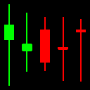

# Data

## Overview

The `DataComposer` is designed to process and analyze financial data from multiple assets. It integrates data from equities, currencies, and bonds, computes relevant financial metrics, and generates visual representations of the data. This project facilitates the analysis of asset movements and provides visual insights into financial trends.

### Key Directories and Files

- **data/**: The main directory containing all project-related files and subdirectories.
  - **modules/**: Contains the core modules for processing the data.
    - **__init__.py**: Initialization file for the modules package.
    - **calculator.py**: Contains the `outcomes` function to calculate the percentage changes and movements for the assets.
    - **download.py**: Contains functions to download data.
    - **graph.py**: Contains the `create_image` function to generate visual representations of the data.
    - **process.py**: Contains the `DataComposer` class and `process` function to handle data processing, analysis, and image generation.
  - **processed/**: Directory where processed data will be saved.
  - **unprocessed/**: Directory where raw, unprocessed data is stored.
  - **__init__.py**: Initialization file for the data package.
  - **sample_image_generation.png**: PNG file containing an embedded image of a sample chart generated by the grapher.

## How It Works

### Data Loading and Processing

1. **Loading Data**:
   - Data files for equities, currencies, and bonds are loaded from the `unprocessed` directory.
   - Each asset's data is stored in an instance of the `Asset` class.

2. **Cropping Data**:
   - The data is cropped to the effective date range where all three assets have available data. This ensures synchronized analysis across all assets.

3. **Generating Lookback Windows**:
   - Rolling lookback windows of a specified length are generated for each asset. These windows are used to analyze historical data over defined periods.

4. **Calculating Percentage Changes**:
   - The `outcomes` function in `calculator.py` calculates the percentage change for each asset's closing price (or index for bonds). This helps in understanding daily movements.

5. **Analyzing Movements**:
   - Movements are analyzed by categorizing changes as long (positive) or short (negative). The cumulative sum of these movements is computed to gain insights into overall trends.

6. **Generating Images**:
   - The `create_image` function in `graph.py` generates visual representations of the data. These images provide visual insights into the financial trends of the assets.
   - Generated images can be saved as PNG files.

### Saving Processed Data

- Processed data, including generated images and computed metrics, are saved in the `processed` directory. This organized structure ensures easy access and further analysis.

#### Sample generated Chart

