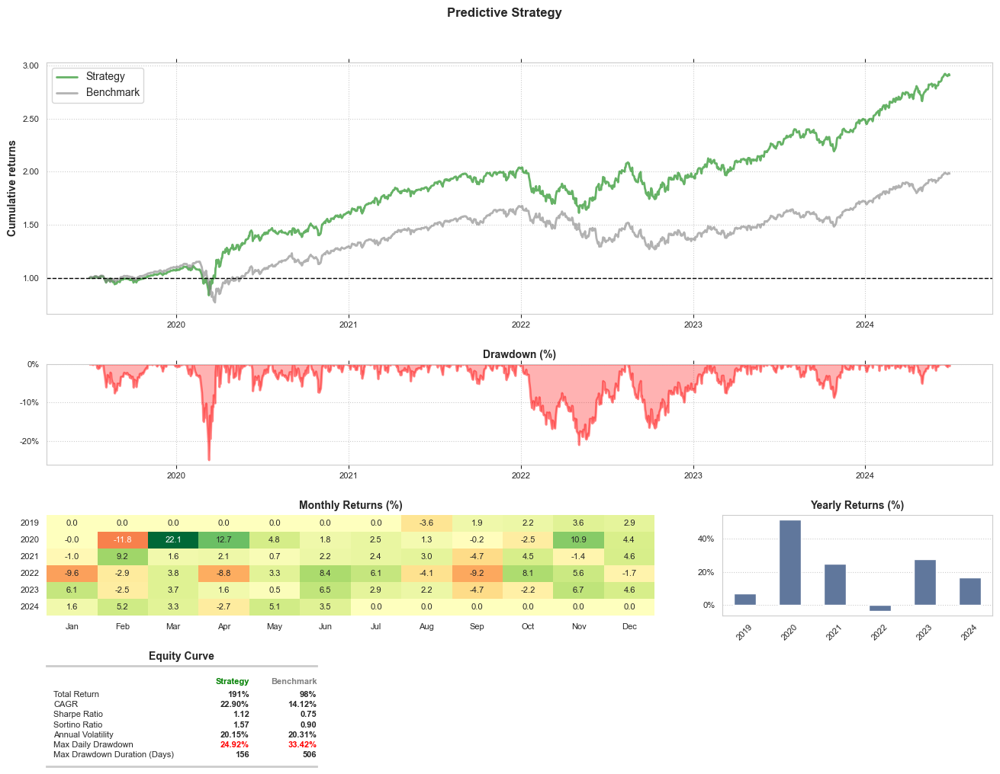

# Notebooks

This folder contains the executable python notebooks where training and testing happens.

## Model training

To train the CNN, we are using the [Model Training](./Model%20training.ipynb) notebook, whihc contains the model development, data loading and splitting, training, validating and testing.

## Backtesting

To check the profitability of the trading model, we are [backtesting](https://www.investopedia.com/terms/b/backtesting.asp) the strategy on one of the largest US market indices, the S&P 500.

Our strategy is shown with `green` while the benchmark strategy with `grey` follows a `buy and hold` approach below.

